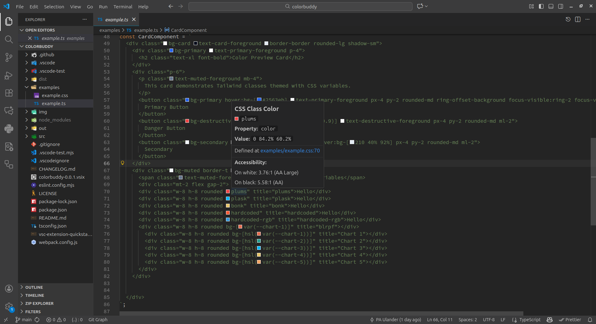

[](https://github.com/pa-ulander/color-buddy/actions/workflows/tests.yml) 


## ColorBuddy - Your VS Code Color Companion

Adds color indicators and mouseover information anywhere a common color code is found in text or code. Find color definitions and navigate fast just like you are used to. Helps with theming or to manage cumbersome refactoring and accessability concerns. Finds definitions from CSS variables, Tailwind classes, and CSS class names with color properties. Plays nice together with other extensions.

## Latest New Features
*   **Inline color indicator** beside each detected color value
*   **Mouseover preview** that shows the selected color and instructions
*   **Native VS Code color picker** available on click for supported values
*   **Configurable language support** via the `colorbuddy.languages` setting
*   **Tailwind compact HSL support** in addition to hex, rgb/rgba, and hsl/hsla and more  
*   **Lightweight and performant** with caching and efficient parsing
*   **accessibility testing** with contrast ratio info in the hover tooltip

 
 

## Usage

1.  Open any file in a language covered by `colorbuddy.languages` (defaults include CSS, HTML, JS/TS, Markdown, and more)
2.  Look for the inline color indicator next to recognized color codes
3.  Hover over the color swatch or code to open vscode's tooltip and display color details
4.  When hovering a color definition, the tooltip will contain VS Codes colorpicker enchanced with color information.

## Supported Color Formats

*   Hex: `#f00`, `#ff0000`, `#ff0000cc`
*   RGB / RGBA: `rgb(255, 0, 0)`, `rgba(255, 0, 0, 0.5)`
*   HSL / HSLA: `hsl(0 100% 50%)`, `hsla(0 100% 50% / 0.5)`
*   Tailwind compact HSL: `0 100% 50%`, `0 100% 50% / 0.5`

## Configuration

*   `colorbuddy.languages`: array of VS Code language identifiers that ColorBuddy should scan. Edit it from the Settings UI or add to your `settings.json`:

```
"colorbuddy.languages": [
  "css",
  "scss",
  "sass",
  "html",
  "markdown"
]
```

*   `colorbuddy.enableTelemetry`: opt-in toggle that lets ColorBuddy record anonymous quick action usage metrics. Disabled by default; no telemetry is collected unless you enable this setting.

### Telemetry endpoint & credentials

ColorBuddy reads the telemetry destination and any required credentials from environment variables so nothing sensitive lives in your VS Code settings. Create a `.env` file alongside your workspace and add the following keys (or export them in your shell):

```
COLORBUDDY_TELEMETRY_ENDPOINT=https://your-api.example.com/colorbuddy/metrics
COLORBUDDY_TELEMETRY_API_KEY=replace-with-api-key
# Optional overrides
# COLORBUDDY_TELEMETRY_API_KEY_HEADER=x-api-key
# COLORBUDDY_TELEMETRY_USERNAME=service-account
# COLORBUDDY_TELEMETRY_PASSWORD=replace-with-password
```

API keys are sent via the configured header (default `x-api-key`). If you provide both `COLORBUDDY_TELEMETRY_USERNAME` and `COLORBUDDY_TELEMETRY_PASSWORD`, ColorBuddy will fall back to HTTP Basic authentication instead. Update the `.env` file (or your environment variables) and reload VS Code whenever you rotate credentials.

**Default languages include**

*   **CSS/Styling**: `css`, `scss`, `sass`, `less`, `stylus`, `postcss`
*   **Markup**: `html`, `xml`, `svg`
*   **JavaScript/TypeScript**: `javascript`, `javascriptreact`, `typescript`, `typescriptreact`
*   **Common Frameworks**: `vue`, `svelte`, `astro`
*   **Data/Config**: `json`, `jsonc`, `yaml`, `toml`
*   **Markdown**: `markdown`, `mdx`
*   **Programming Languages**: `python`, `ruby`, `php`, `perl`, `go`, `rust`, `java`, `kotlin`, `swift`, `csharp`, `cpp`, `c`, `objective-c`, `dart`, `lua`
*   **Scripting**: `shellscript`, `powershell`
*   **Query Languages**: `sql`, `graphql`
*   **Other**: `plaintext`

Add or remove identifiers to fit your workspace. Use `"*"` to enable color detection in all file types. Changes apply immediately.

## Installation

*Install from VS Code Marketplace*

Open VSCode and type `ctrl+p`, then type: `ext install PAUlander.colorbuddy`


*Install from vsix binary*

1.  Download [latest vsix binary](https://github.com/pa-ulander/color-buddy/releases/download/v0.0.3/colorbuddy-0.0.3.vsix) or run `npm run package-vsix` to generate your own.
2.  In VS Code press `Ctrl+Shift+P` (`Cmd+Shift+P` on macOS) and choose `Extensions: Install from VSIX`.
3.  Pick the downloaded/generated `.vsix` file and reload the editor when prompted.
4.  Alternatively, install via CLI with `code --install-extension color-buddy-*.*.*.vsix`.


## License

MIT