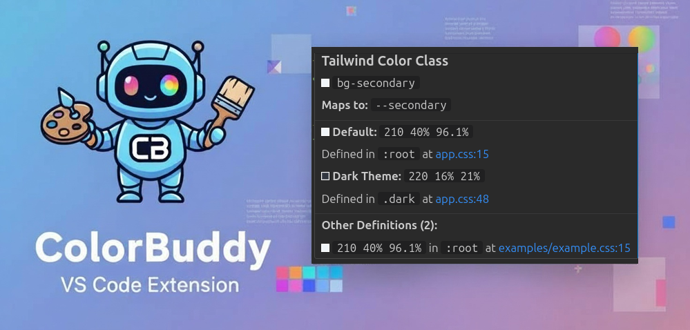
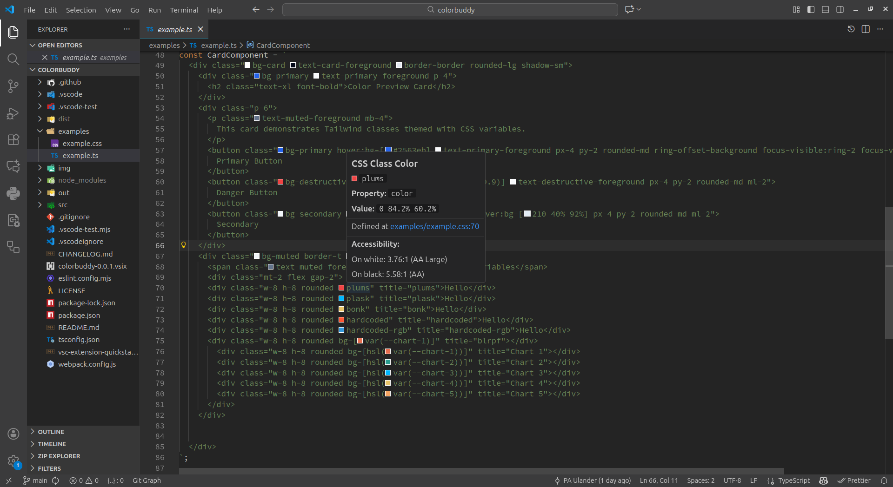

[](https://github.com/pa-ulander/color-buddy/actions/workflows/tests.yml) 



## ColorBuddy - Your VS Code Color Companion

Adds color indicators and mouseover information anywhere a common color code is found in text or code. Find color definitions and navigate fast to definitions just like you are used to from your code. Helps with theming or to manage cumbersome refactoring and accessability concerns. Finds definitions from CSS variables, Tailwind classes, and CSS class names with color properties. Plays nice together with other extensions.

## Features
*   **Hover a color for a quick summary tooltip** Inside the tooltip, you can access quick actions. 
      * **The following quick actions are available**:
      * Display summary - displays a detailed summary of the color
      * Find usages - searches the workspace for usages of the color
      * Convert - gives you the option to convert between various formats in one or many occurances across your codebase, ie it is possible to perform a controlled bulk convert. Not limited to a single format. You may convert any occurrance to any format you want, so be careful.
      * Test Accessibility - Run it to show accessability info.
      * Show pallette - Displays an overview of all occuring colors and simplifies work with themes.

*   **Quick jump** ctrl+click to quick jump to a color definition, works on CSS variables, Tw classes, CSS class names with color properties and so on...
*   **Inline color indicator** beside each detected color value
*   **Configurable language support** via the `colorbuddy.languages` setting
*   **Tailwind compact HSL support** in addition to hex, rgb/rgba, and hsl/hsla and more  
*   **Lightweight and performant** with caching and efficient parsing
*   **Accessibility testing** with contrast ratio info in the hover tooltip and a dedicated Activity Bar report view

 
 

## Usage

1.  Open any file in a language covered by `colorbuddy.languages` (defaults include CSS, HTML, JS/TS, Markdown, and more)
2.  Look for the inline color indicator next to recognized color codes
3.  Hover over the color swatch or code to open vscode's tooltip and display color details
4.  Ctrl+click to quickly navigate to a color definition (if applicable)
5.  When hovering a color definition, the tooltip will contain VS Codes colorpicker enchanced with color information.

### Accessibility Report Panel

Run `ColorBuddy: Test Color Accessibility` (or fire the quick action from any color hover) to open the ColorBuddy Activity Bar view. The new panel surfaces:

* Detailed WCAG contrast checks against light and dark backgrounds
* Color name, hex, and brightness metadata sourced from the hover insights
* Alternate format conversions you can copy directly

Click the ColorBuddy icon in the Activity Bar at any time to revisit the latest report.

## Supported Color Formats

*   Hex: `#f00`, `#ff0000`, `#ff0000cc`
*   RGB / RGBA: `rgb(255, 0, 0)`, `rgba(255, 0, 0, 0.5)`
*   HSL / HSLA: `hsl(0 100% 50%)`, `hsla(0 100% 50% / 0.5)`
*   Tailwind compact HSL: `0 100% 50%`, `0 100% 50% / 0.5`
*   OKLAB: `oklab(0.627 0.224 0.125)`, `oklab(0.627 0.224 0.125 / 0.5)`
*   OKLCH: `oklch(0.627 0.224 0.125)`, `oklch(0.627 0.224 0.125 / 0.5)`

## Configuration

*   `colorbuddy.languages`: array of VS Code language identifiers that ColorBuddy should scan. Edit it from the Settings UI or add to your `settings.json`:

```
"colorbuddy.languages": [
  "css",
  "scss",
  "sass",
  "html",
  "markdown"
]
```

**Default languages include**

*   **CSS/Styling**: `css`, `scss`, `sass`, `less`, `stylus`, `postcss`
*   **Markup**: `html`, `xml`, `svg`
*   **JavaScript/TypeScript**: `javascript`, `javascriptreact`, `typescript`, `typescriptreact`
*   **Common Frameworks**: `vue`, `svelte`, `astro`
*   **Data/Config**: `json`, `jsonc`, `yaml`, `toml`
*   **Markdown**: `markdown`, `mdx`
*   **Programming Languages**: `python`, `ruby`, `php`, `perl`, `go`, `rust`, `java`, `kotlin`, `swift`, `csharp`, `cpp`, `c`, `objective-c`, `dart`, `lua`
*   **Scripting**: `shellscript`, `powershell`
*   **Query Languages**: `sql`, `graphql`
*   **Other**: `plaintext`

Add or remove identifiers to fit your workspace. Use `"*"` to enable color detection in all file types. 
Changes apply immediately.

## Installation

*Install from VS Code Marketplace*

Open VSCode and type `ctrl+p`, then type: `ext install PAUlander.colorbuddy`


*Install from vsix binary*

1.  Download [latest vsix binary](https://github.com/pa-ulander/color-buddy/releases/download/v0.0.61/colorbuddy-0.0.61.vsix) or clone this repository and run `npm run package-vsix` to generate your own.
2.  In VS Code press `Ctrl+Shift+P` (`Cmd+Shift+P` on macOS) and choose `Extensions: Install from VSIX`.
3.  Pick the downloaded/generated `.vsix` file and reload the editor when prompted.
4.  Alternatively, install via CLI with `code --install-extension color-buddy-*.*.*.vsix`.


## Disclaimer
This extension are still in early development stages.  It adds color indicators and hover information, but might not cover all edge cases or color formats yet. Please report any issues or feature requests.

## License

MIT